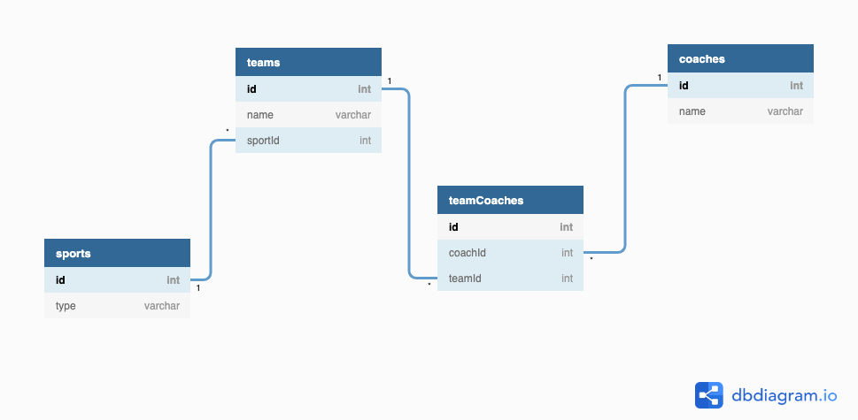

# Joining Related Data

`database.json` shows how you've been storing data in your json files up until now

`one-to-many.json` refactors `database.json` to show a one to many relationship between `teams` and `sports`
* Each team can be associated with only ONE sport
* Each sport can have MANY teams

`many-to-many.json` refactors `one-to-many.json` to also show the many to many relationship between `teams` and `coaches`. Many to many require join tables whose purpose is to store the relationship between the two entities.
* Each team can have MANY coaches
* Each coach can have MANY teams

